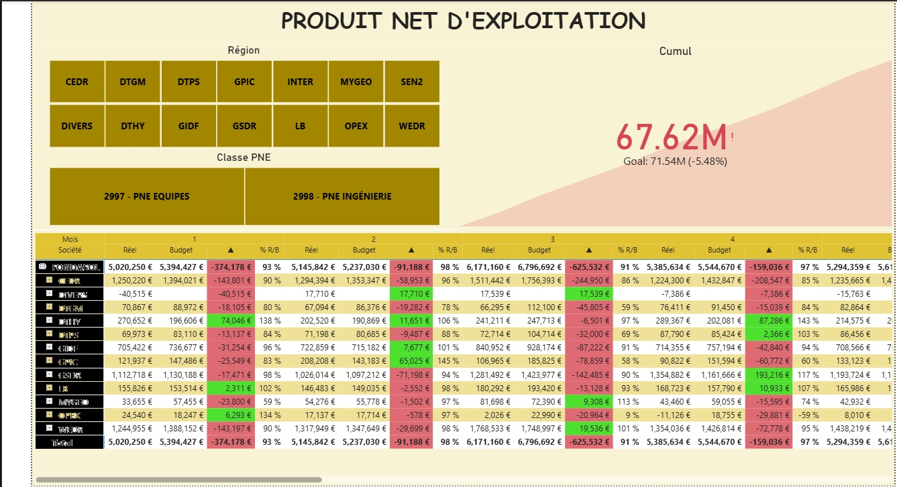

# PNE – Produit Net d'Exploitation | Actual vs Budget

> Power BI financial reporting dashboard for XYZ company tracking Net Operating 
> Income (PNE) across 14 regions and agencies — comparing monthly actuals 
> vs budget with variance analysis, staffing ratios, and cumulative goal tracking.

---

## 📊 Dashboards

### PNE Global – Actual vs Budget

> Executive financial matrix comparing Réel vs Budget month-by-month across 
> all XYZ company france regions (CEDR, DTGM, DTHY, DTPS, GIDF, GPIC, GSDR, LB, MAR, 
> MYGEO, OPEX, WEDR). Tracks cumulative PNE of **67.62M€** against a 
> goal of 71.54M€ (-5.48%). Color-coded variance columns (▲) highlight 
> over/under performance per region and month, with % R/B ratio per period.

---

### PNE Unitaire – Agency Level Detail

> Granular agency-level breakdown of PNE Budget vs Réel per month (2023), 
> segmented by agency code (06GT, 13EN, 14GT…) across all departments. 
> Tracks staffing metrics: Ingénieurs, Techniciens, Bureau Op., Équipes 
> Sondages — with weighted valorisation coefficients 
> (Ingénieurs=1 / Techniciens=0.75 / Bureau Op.=0.5 / Équipes=1). 
> Highlights budget overruns in red (PNEu B. column).

---

## 🔍 Key Features

- Region and agency navigation with month-by-month drill
- Variance indicators (▲) with % Réel/Budget ratio per period
- Staffing headcount tracking (INGE, TECH, BURop, NB EQUIPES, EFFECTIF)
- Weighted PNE unitaire calculation per population class
- PNE class filter: **2997 – PNE Équipes** / **2998 – PNE Ingénierie**
- Cumulative goal tracker with deviation %
